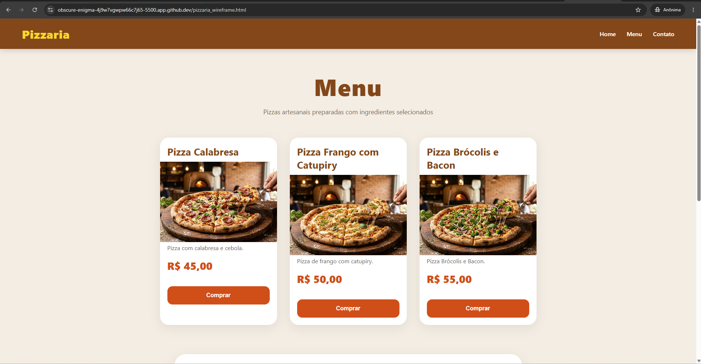
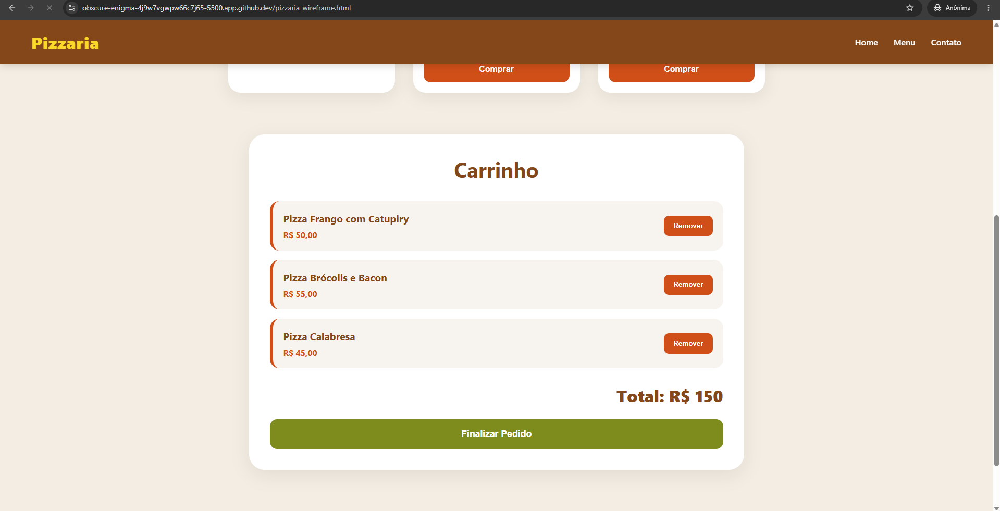
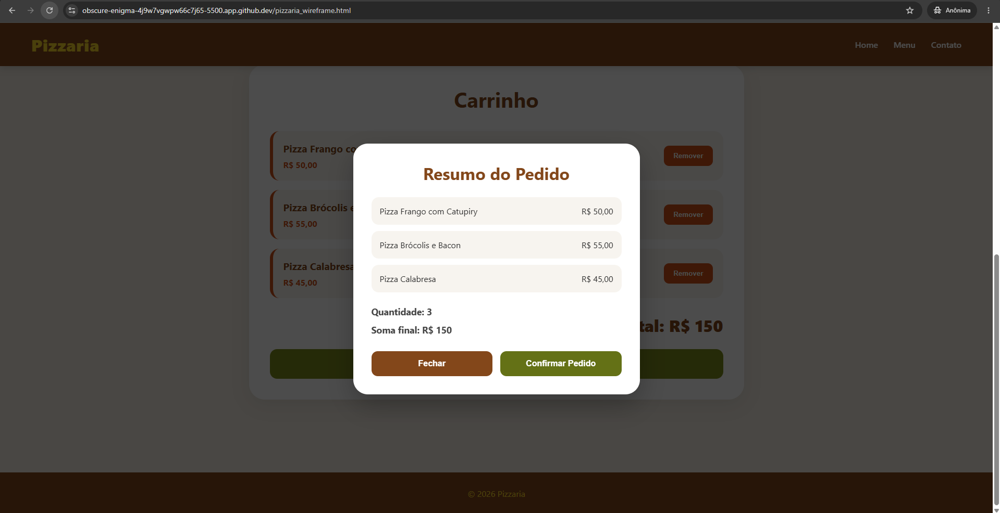

# Pizzaria - Atividade 3

## Descrição
Nesta atividade foi implementado o uso do localStorage para manter o carrinho salvo mesmo após atualizar a página.

---

## Funcionalidades

- Salvamento automático do carrinho
- Persistência dos dados após atualizar a página
- Uso de localStorage.setItem()
- Uso de localStorage.getItem()
- Uso de JSON.stringify()
- Uso de JSON.parse()

---

## Tecnologias Utilizadas

- HTML5
- CSS3
- JavaScript

---

## Como Executar pelo Terminal

### 1. Abrir o projeto no VSCode ou GitHub Codespaces

### 2. Abrir o terminal

### 3. Executar o comando:

```bash
python3 -m http.server 5500
```

### 4. Abrir no navegador:

```bash
http://localhost:5500
```

---

## Prints do Projeto





